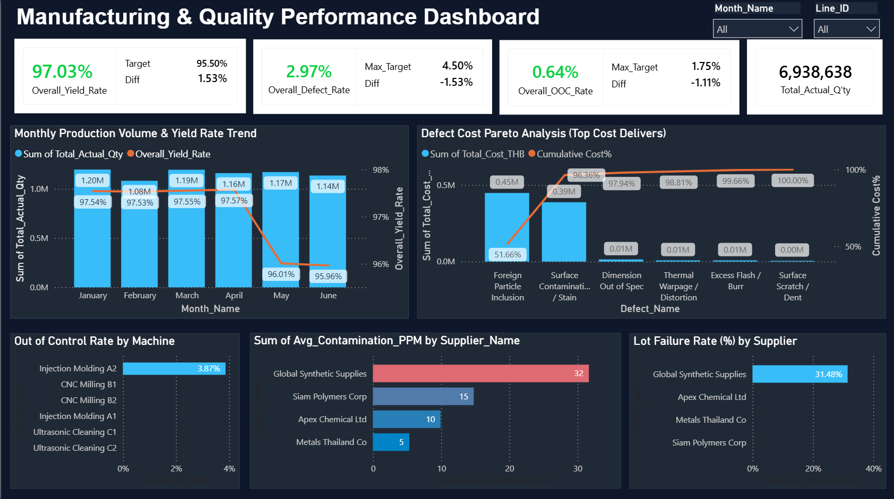

# Manufacturing & Quality Performance Dashboard

An interactive Power BI dashboard designed to monitor production efficiency, defect management, and supplier quality performance in real time.

---

## Executive Summary
This dashboard provides high-level visibility for plant managers and quality engineers to track production yield, analyze defect root causes, and monitor supplier compliance.

---

## Key Features & Metrics
* **KPI Header Cards:** Real-time tracking of `Overall Yield Rate (97.03%)`, `Defect Rate`, `Out of Control Rate`, and `Total Actual Quantity`.
* **Production & Yield Trend:** Combined Column and Line chart for monthly volume vs. yield rates.
* **Pareto Defect Analysis:** Identifies top cost-contributing defects (*Foreign Particle Inclusion & Surface Contamination*).
* **Machine & Supplier Quality:** Conditional formatting highlights high-risk areas:
  * Highest OOC Machine: *Injection Molding A2 (3.87%)*
  * Top Defect Supplier: *Global Synthetic Supplies (32 PPM, 31.48% Lot Failure)*

---

## Tools
* **Microsoft Power BI**
* **Data Transformation:** Power Query
* **Data Modeling:** DAX (Calculated Measures)

---

## Project Files
* `Manufacturing performance dashboard.pbix` - Power BI Desktop File
* `Dashboard_preview.png` - Dashboard Preview Image
